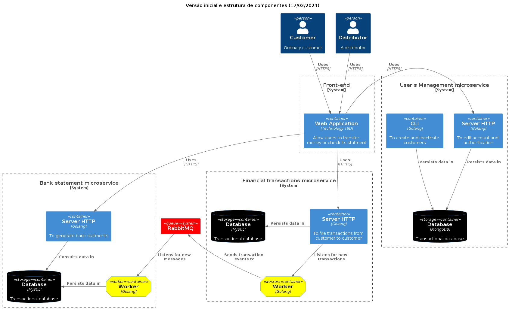

# STUDY TRANSACTION PLATFORM

## Objetivo
Este repositório contém uma base de microserviços e um front end, construído com o objetivos pessoais do autor em estudar técnicas de design pattern, testes automatizados, arquitetura, observabilidade e outros fins.

## Diagrama

